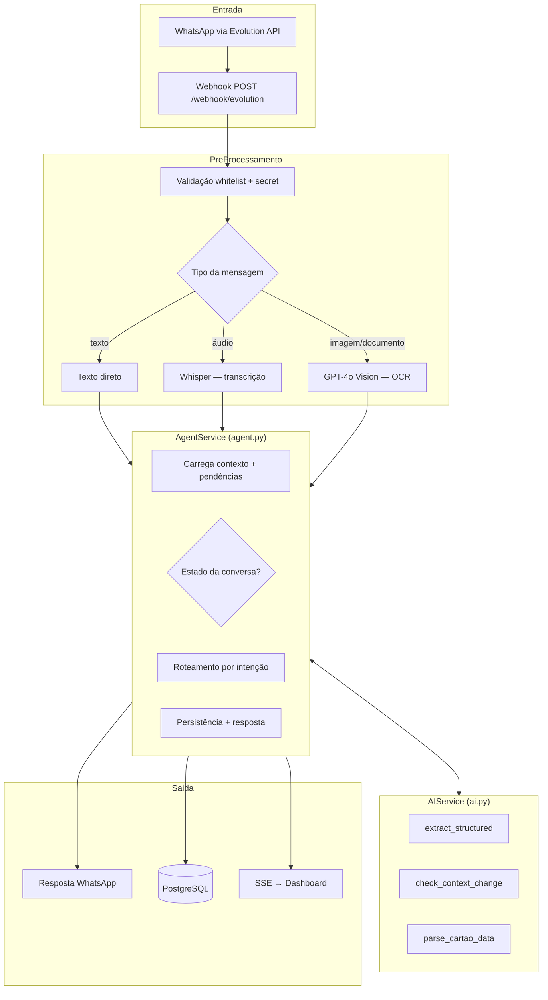
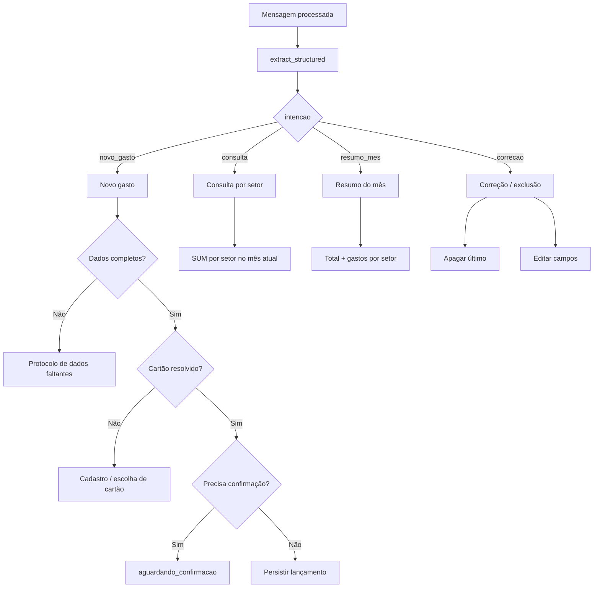
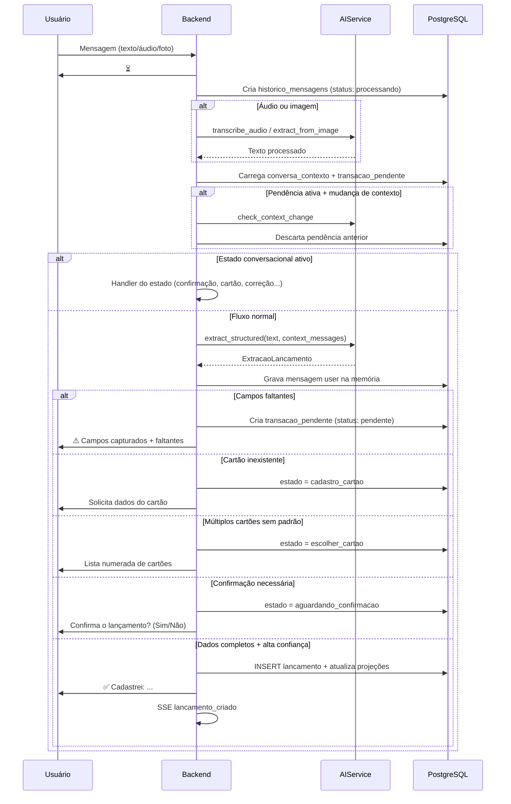
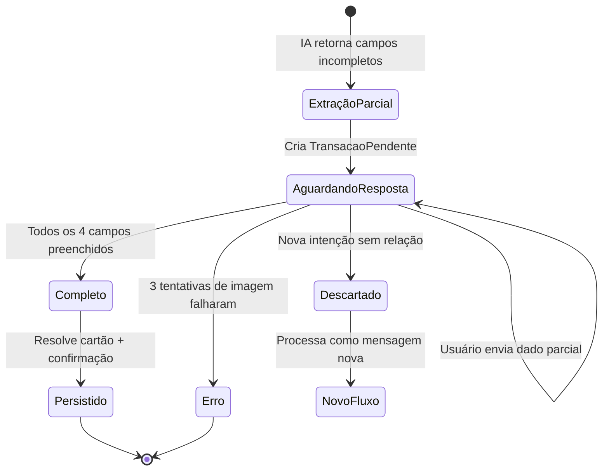
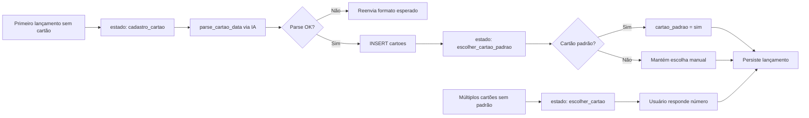
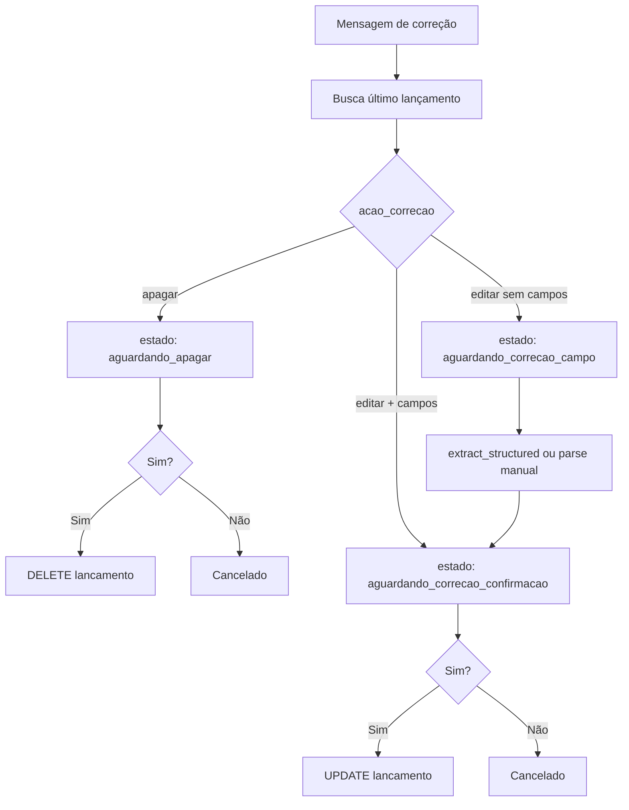
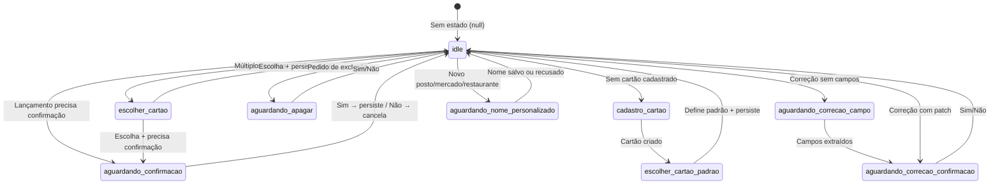
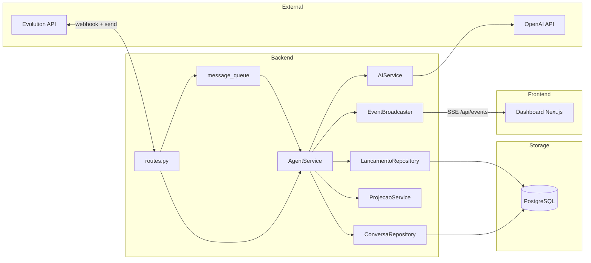

# Documentação do Agente de IA — GastoZap

Documentação técnica detalhada do agente de inteligência artificial que processa mensagens do WhatsApp, extrai dados financeiros estruturados e orquestra fluxos conversacionais multi-turno.

**Arquivos de referência no código:**

| Componente | Arquivo |
| ---------- | ------- |
| Orquestrador do agente | `backend/app/services/agent.py` |
| Serviço de IA (OpenAI) | `backend/app/services/ai.py` |
| Webhook e pré-processamento | `backend/app/api/routes.py` |
| Schema de extração | `backend/app/schemas/__init__.py` |
| Memória de conversa | `backend/app/models/conversa.py` |

### Visual do fluxo

| Formato | Arquivo | Uso |
| ------- | ------- | --- |
| **Interativo (Cursor Canvas)** | [gastozap-agente-fluxo.canvas.tsx](file:///C:/Users/Brunno/.cursor/projects/d-Works-Cyrela-Contrutora-portfolio-repo/canvases/gastozap-agente-fluxo.canvas.tsx) | Abra ao lado do chat no Cursor — 4 abas: pipeline, novo gasto, intenções e estados |
| **SVG estático (fluxo)** | [`Fluxo_Agente.svg`](./Fluxo_Agente.svg) | Visualização em navegador, VS Code ou GitHub |
| **SVG estático (tabelas)** | [`Modelo_Dados.svg`](./Modelo_Dados.svg) | Diagrama ER + colunas principais |
| **Canvas interativo (tabelas)** | [gastozap-modelo-dados.canvas.tsx](file:///C:/Users/Brunno/.cursor/projects/d-Works-Cyrela-Contrutora-portfolio-repo/canvases/gastozap-modelo-dados.canvas.tsx) | Diagrama ER, colunas e relacionamentos |

---

## 1. Visão Geral

O agente é composto por **duas camadas**:



| Camada | Responsabilidade |
| ------ | ---------------- |
| **AIService** | Chamadas à OpenAI: transcrição, visão, extração JSON, detecção de mudança de contexto |
| **AgentService** | Máquina de estados, regras de negócio, persistência, formatação de respostas |

---

## 2. Entradas (Inputs)

### 2.1 Entrada principal — Webhook Evolution API

**Endpoint:** `POST /webhook/evolution`

| Campo / Header | Tipo | Descrição |
| -------------- | ---- | --------- |
| `x-webhook-secret` ou `apikey` | Header | Validação de autenticidade do webhook |
| `event` | string | Deve ser `messages.upsert`, `MESSAGES_UPSERT` ou `message` |
| `data.key.remoteJid` | string | Número do remetente (ex.: `5511999999999@s.whatsapp.net`) |
| `data.message` | object | Payload da mensagem (texto, áudio, imagem ou documento) |

**Filtros aplicados antes do agente:**

- Mensagens enviadas pelo próprio bot (`fromMe`) são ignoradas
- Número deve estar na whitelist (`ALLOWED_PHONE_NUMBERS` / `WHITELIST_NUMBERS`)
- Mensagens vazias são ignoradas

### 2.2 Tipos de mensagem suportados

| Tipo WhatsApp | `tipo` interno | Pré-processamento | `origem` no banco |
| ------------- | -------------- | ----------------- | ----------------- |
| Texto simples / estendido | `texto` | Nenhum | `whatsapp-texto` |
| Áudio (PTT ou arquivo) | `audio` | `AIService.transcribe_audio()` via Whisper | `whatsapp-audio` |
| Imagem (nota fiscal, extrato) | `imagem` | `AIService.extract_from_image()` via GPT-4o Vision | `whatsapp-foto` |
| Documento (imagem/PDF) | `documento` | Mesmo fluxo de imagem | `whatsapp-foto` |

### 2.3 Parâmetros internos de `process_message()`

```python
async def process_message(
    db: AsyncSession,
    phone: str,              # Número normalizado do usuário
    msg_info: dict,          # Metadados da mensagem (tipo, message_id, key_id)
    processed_text: str,     # Texto final (original, transcrito ou OCR)
    notify_callback=None,    # Callback para SSE do dashboard
) -> str
```

**Estrutura de `msg_info`:**

| Campo | Tipo | Descrição |
| ----- | ---- | --------- |
| `tipo` | `texto` \| `audio` \| `imagem` \| `documento` | Tipo detectado |
| `message_id` | string \| null | ID da mensagem na Evolution API |
| `key_id` | string \| null | `key.id` do payload |
| `conteudo` | string | Texto ou legenda original |
| `skip_hourglass` | bool (opcional) | Evita reenviar ⏳ em mídia já processada na fila |
| `skip_context_check` | bool (opcional) | Pula verificação de abandono de pendência |

### 2.4 Entrada para extração estruturada (IA)

O modelo recebe o texto processado mais contexto opcional:

| Parâmetro | Origem | Uso |
| --------- | ------ | --- |
| `text` | Mensagem do usuário | Conteúdo principal para extração |
| `context_messages` | Últimas 10 mensagens de `conversa_contexto.mensagens` | Desambiguação multi-turno |
| `focus_pending` | `TransacaoPendente` ativa | Completar campos faltantes |

### 2.5 Variáveis de ambiente que afetam o agente

| Variável | Padrão | Efeito |
| -------- | ------ | ------ |
| `OPENAI_API_KEY` | — | Sem chave, usa fallback por regex (confiança baixa) |
| `OPENAI_MODEL` | `gpt-4o` | Modelo para extração, visão e detecção de contexto |
| `WHISPER_MODEL` | `whisper-1` | Transcrição de áudio |
| `ALWAYS_CONFIRM_MODE` | `true` | Exige confirmação antes de salvar todo lançamento |
| `HIGH_VALUE_THRESHOLD` | `500.0` | Valores ≥ limite exigem confirmação |
| `RETRY_LIMIT` | `3` | Tentativas máximas para imagens com extração parcial |

---

## 3. Saídas (Outputs)

### 3.1 Resposta ao usuário (WhatsApp)

Toda resposta passa por `_reply()`, que:

1. Envia texto via Evolution API (`evolution_client.send_text`)
2. Grava na memória de conversa (`conversa_contexto.mensagens`) como role `assistant`

**Formatos de saída por cenário:**

| Cenário | Exemplo de saída |
| ------- | ---------------- |
| Sucesso | `✅ Cadastrei: Avila — R$ 97,22 — mercado — a vista` |
| Dados parciais | `⚠️ Capturei:` + lista de campos + `❌ Faltou:` + instruções |
| Confirmação | `Confirma o lançamento?` + resumo + `(Sim/Não)` |
| Consulta | `Você gastou R$ X,XX em [setor] este mês.` |
| Resumo mensal | `📊 Resumo de MM/AAAA:` + total + top 5 setores |
| Correção | Resumo das alterações + `(Sim/Não)` |
| Cancelamento | `Lançamento cancelado.` / `Correção cancelada.` |
| Processando | `⏳` (ampulheta) |

### 3.2 Persistência no banco

| Tabela | Quando é escrita |
| ------ | ---------------- |
| `historico_mensagens` | Toda mensagem recebida (auditoria) |
| `transacoes_pendentes` | Extração parcial (campos faltantes) |
| `conversa_contexto` | Estado da máquina + histórico de mensagens |
| `lancamentos` | Gasto confirmado e completo |
| `cartoes` | Cadastro de cartão de crédito |
| `estabelecimentos` | Novo estabelecimento ou nome personalizado |

### 3.3 Eventos para o Dashboard (SSE)

Via `notify_callback` → `event_broadcaster`:

| Evento | Payload | Momento |
| ------ | ------- | ------- |
| `lancamento_criado` | `{ "type": "refresh", "type": "lancamento_criado", "id": <id> }` | Após persistir lançamento |
| `lancamento_atualizado` | `{ ..., "id": <id> }` | Após correção confirmada |
| `lancamento_removido` | `{ ..., "id": <id> }` | Após exclusão confirmada |

### 3.4 Schema de saída da IA — `ExtracaoLancamento`

```json
{
  "intencao": "novo_gasto | correcao | consulta | resumo_mes | cadastro_cartao | confirmacao | outro",
  "estabelecimento": "string | null",
  "setor": "mercado | ferramenta | lanche | cursos | viagem | gasolina | restaurante | outros",
  "tipo": "a_vista | assinatura | fixo | parcelado",
  "valor": 97.22,
  "parcelas": "3 de 12 | null",
  "data_hora": "2026-07-08T12:00:00+00:00",
  "confianca": 0.85,
  "campos_faltantes": ["tipo"],
  "acao_correcao": "apagar | editar",
  "campos_correcao": { "valor": 150.00 },
  "lancamento_alvo": "ultimo | especifico",
  "mudou_contexto": false
}
```

**Campos essenciais para persistência** (todos obrigatórios):

- `estabelecimento`
- `setor`
- `tipo`
- `valor`

---

## 4. Funcionalidades do Agente

### 4.1 Mapa de intenções



| Intenção | Gatilhos típicos | Ação |
| -------- | ---------------- | ---- |
| `novo_gasto` | "gastei", "paguei", "comprei", foto de nota | Fluxo completo de lançamento |
| `consulta` | "quanto gastei em [setor]" | Soma do setor no mês corrente |
| `resumo_mes` | "resumo", "resumo do mês" | Total + breakdown por setor (top 5) |
| `correcao` | "apaga", "corrige", "altera" | Edição ou exclusão do último lançamento |

### 4.2 Novo gasto — fluxo detalhado



**Regras de confirmação obrigatória** (`needs_confirm = true`):

1. `ALWAYS_CONFIRM_MODE=true` (padrão), **ou**
2. `valor >= HIGH_VALUE_THRESHOLD` (padrão R$ 500), **ou**
3. `confianca < 0.8`

### 4.3 Protocolo de dados faltantes

Quando qualquer campo essencial está ausente, o lançamento **não é salvo**.



**Resposta ao usuário (formato):**

```
⚠️ Capturei:
• estabelecimento: Avila
• valor: 97.22
• setor: mercado
❌ Faltou: tipo
Você pode: digitar, enviar áudio ou reenviar a mídia.
```

**Regra de abandono:** Se a próxima mensagem indica um gasto/comando novo (palavras-chave: `gastei`, `paguei`, `comprei`, `apaga`, `quanto`, `resumo`) **ou** a IA detecta `mudou_contexto=true`, a pendência é descartada.

### 4.4 Cadastro e seleção de cartão



**Formato esperado para cadastro:**

```
Banco: Nubank
Últimos 4 dígitos: 1234
Vencimento: 12/2028
Bandeira: Mastercard
Limite: 5000
```

### 4.5 Consulta e resumo

| Funcionalidade | Entrada exemplo | Saída |
| -------------- | --------------- | ----- |
| Consulta por setor | "Quanto gastei em mercado esse mês?" | `Você gastou R$ 1.234,56 em mercado este mês.` |
| Resumo mensal | "Me dá o resumo do mês" | Total + até 5 setores com valores |

**Query interna:** `SUM(valor)` filtrado por mês/ano corrente e setor (consulta) ou agrupado por setor (resumo).

### 4.6 Correção e exclusão



**Campos editáveis:** `estabelecimento`, `setor`, `tipo`, `valor`, `parcelas`

**Parse manual de fallback** (sem IA): `valor 150`, `setor mercado`, `estabelecimento Shell`, `tipo parcelado`

### 4.7 Nome personalizado de estabelecimento

Após criar um estabelecimento **novo** nos setores `gasolina`, `restaurante` ou `mercado`:

```
Quer guardar 'Posto Ipiranga' como nome personalizado para buscas futuras? (sim/nao)
Ou envie outro nome, ex: 'Posto Shell', 'Mercado Guanabara'.
```

| Resposta | Ação |
| -------- | ---- |
| `sim` | Salva `nome_sugerido` em `estabelecimentos.obs` |
| `não` | Mantém nome original |
| Texto livre | Salva o texto como nome personalizado |

---

## 5. Máquina de Estados da Conversa

O campo `conversa_contexto.estado` controla handlers prioritários antes da extração de intenção.



| Estado | `dados_estado` típico | Handler |
| ------ | --------------------- | ------- |
| `aguardando_confirmacao` | `extracao`, `cartao_id`, `origem`, `message_id` | `_handle_confirmation` |
| `cadastro_cartao` | `extracao`, `origem` | `_handle_cadastro_cartao` |
| `escolher_cartao` | `extracao`, `cartoes[]` | `_handle_escolha_cartao` |
| `escolher_cartao_padrao` | `extracao`, `cartao_id` | `_handle_escolha_cartao` |
| `aguardando_apagar` | `lancamento_id` | `_handle_apagar_confirmacao` |
| `aguardando_correcao_campo` | `lancamento_id` | `_handle_correcao_campo` |
| `aguardando_correcao_confirmacao` | `lancamento_id`, `patch` | `_handle_correcao_confirmacao` |
| `aguardando_nome_personalizado` | `estabelecimento_id`, `nome_sugerido` | `_handle_nome_personalizado` |

---

## 6. Serviços de IA — Entrada e Saída por Método

### 6.1 `transcribe_audio(audio_bytes, filename)`

| Entrada | Saída |
| ------- | ----- |
| Bytes do áudio OGG/MP3 | Texto transcrito em português |
| Sem `OPENAI_API_KEY` | String vazia `""` |

### 6.2 `extract_from_image(image_bytes, caption)`

| Entrada | Saída |
| ------- | ----- |
| Bytes da imagem + legenda opcional | Texto livre com dados visíveis (estabelecimento, valor, data, itens) |
| Erro ou sem API key | Retorna `caption` original |

### 6.3 `extract_structured(text, context_messages, focus_pending)`

| Entrada | Saída |
| ------- | ----- |
| Texto + até 10 mensagens de contexto | `ExtracaoLancamento` |
| `focus_pending` com capturados/faltantes | Extração focada nos campos pendentes |
| Erro de API | `_fallback_extraction()` por regex |

**System prompt (resumo):** Identifica intenção, extrai campos de gasto, lista `campos_faltantes`, define `confianca` 0.0–1.0. Resposta **apenas JSON**.

### 6.4 `check_context_change(pendente, mensagem)`

| Entrada | Saída |
| ------- | ----- |
| Campos capturados da pendência + nova mensagem | `true` se mudou de contexto, `false` se relacionado |
| Erro de API | `false` (assume relacionado) |

### 6.5 `parse_cartao_data(text)`

| Entrada | Saída |
| ------- | ----- |
| Texto livre com dados do cartão | `{ banco_origem, ultimos_4_digitos, vencimento, bandeira, limite_total }` |
| Texto inválido | `null` |

---

## 7. Status de Processamento (`historico_mensagens.status`)

| Status | Quando |
| ------ | ------ |
| `processando` | Mensagem recebida, em processamento |
| `pendente` | Extração parcial — aguardando dados do usuário |
| `aguardando` | Aguardando confirmação explícita (Sim/Não) |
| `processado` | Lançamento persistido com sucesso |
| `erro` | Imagem falhou após `RETRY_LIMIT` tentativas |

---

## 8. Exemplos Completos (Entrada → Saída)

### 8.1 Lançamento direto (texto completo)

| | |
| - | - |
| **Entrada** | `"Gastei 45 reais no mercado Avila, à vista"` |
| **Extração IA** | `{ intencao: "novo_gasto", estabelecimento: "Avila", setor: "mercado", tipo: "a_vista", valor: 45.00, confianca: 0.9 }` |
| **Saída** (modo confirmação) | `Confirma o lançamento?\nAvila — R$ 45.00 — mercado — a_vista\n(Sim/Não)` |
| **Após "sim"** | `✅ Cadastrei: Avila — R$ 45,00 — mercado — a vista` |

### 8.2 Foto de nota fiscal (dados parciais)

| | |
| - | - |
| **Entrada** | Imagem de nota (sem tipo de pagamento visível) |
| **OCR** | `"Estabelecimento Avila, total R$ 97,22, mercado"` |
| **Extração** | `{ estabelecimento: "Avila", valor: 97.22, setor: "mercado", campos_faltantes: ["tipo"] }` |
| **Saída** | `⚠️ Capturei: ... ❌ Faltou: tipo` |
| **Follow-up** | `"Foi à vista"` → completa → persiste |

### 8.3 Consulta

| | |
| - | - |
| **Entrada** | `"Quanto gastei em gasolina esse mês?"` |
| **Extração** | `{ intencao: "consulta", setor: "gasolina" }` |
| **Saída** | `Você gastou R$ 320,00 em gasolina este mês.` |

### 8.4 Correção

| | |
| - | - |
| **Entrada** | `"Corrige o valor do último para 150"` |
| **Extração** | `{ intencao: "correcao", acao_correcao: "editar", campos_correcao: { valor: 150 } }` |
| **Saída** | `Confirma a correção do lançamento?` + diff + `(Sim/Não)` |

---

## 9. Diagrama de Componentes



---

## 10. Referências

- Requisitos funcionais completos: [`Especificacoes.md`](./Especificacoes.md) (seções RF-05 a RF-41)
- Visão de produto: [`Visao_Geral.md`](./Visao_Geral.md)
- Setup de ambiente: [`Setup_Ambiente.md`](./Setup_Ambiente.md)
