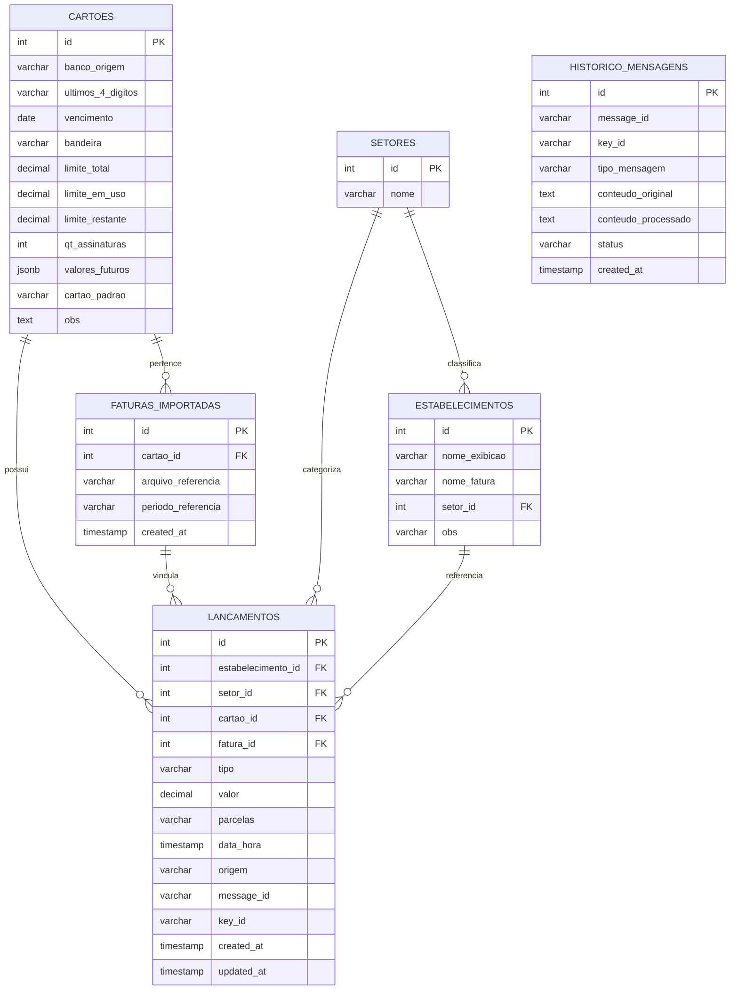
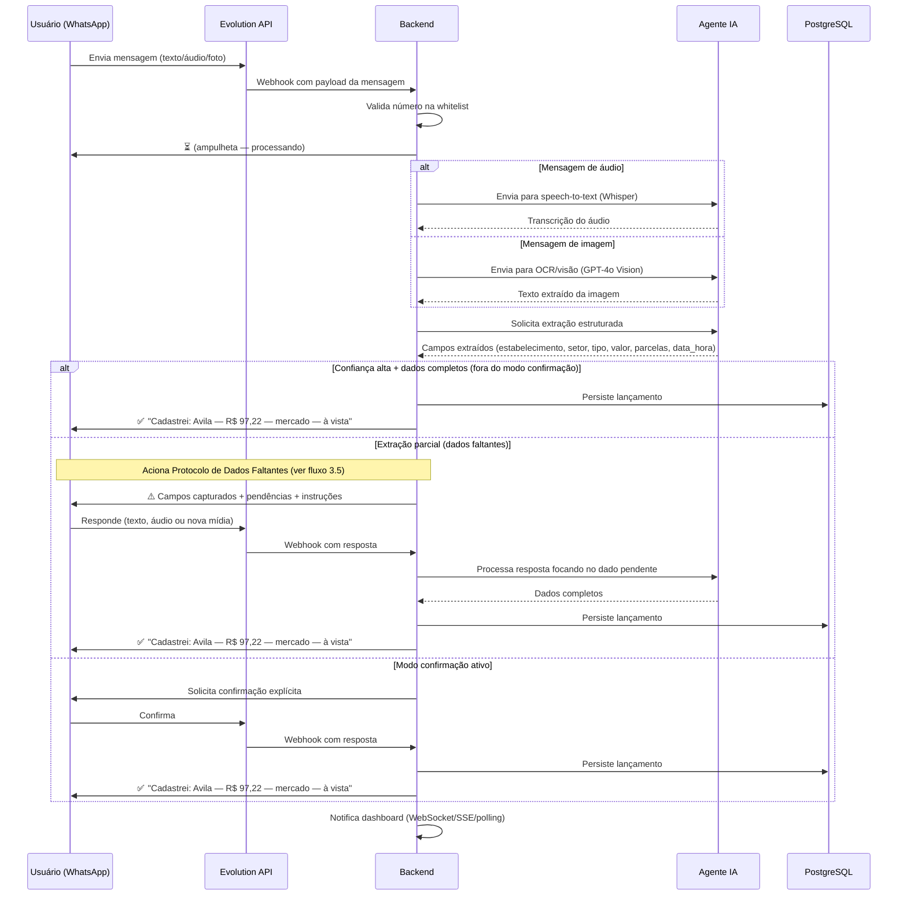
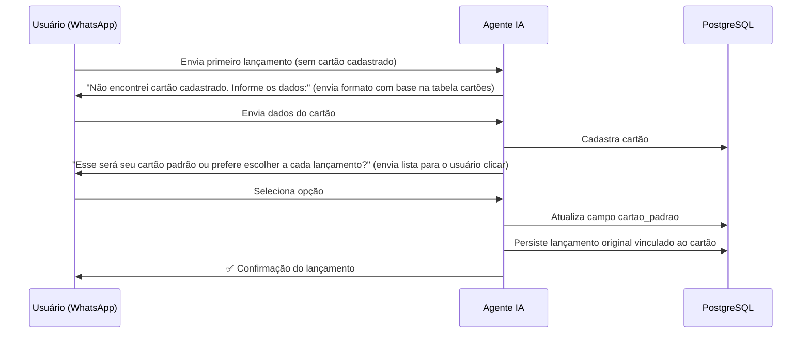
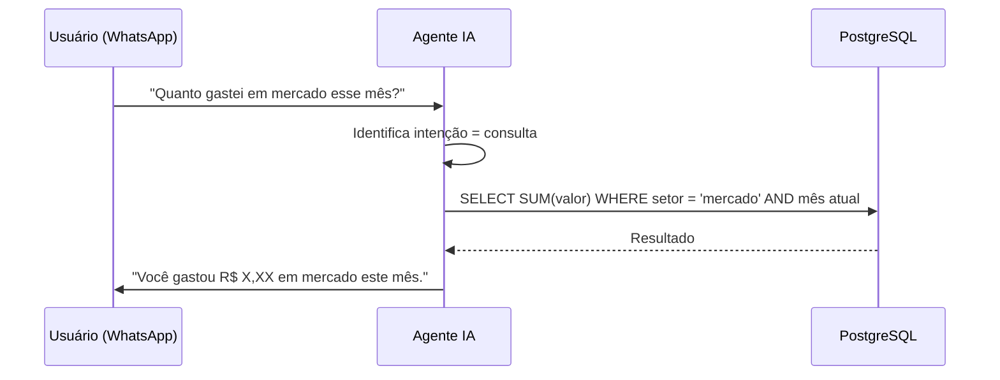
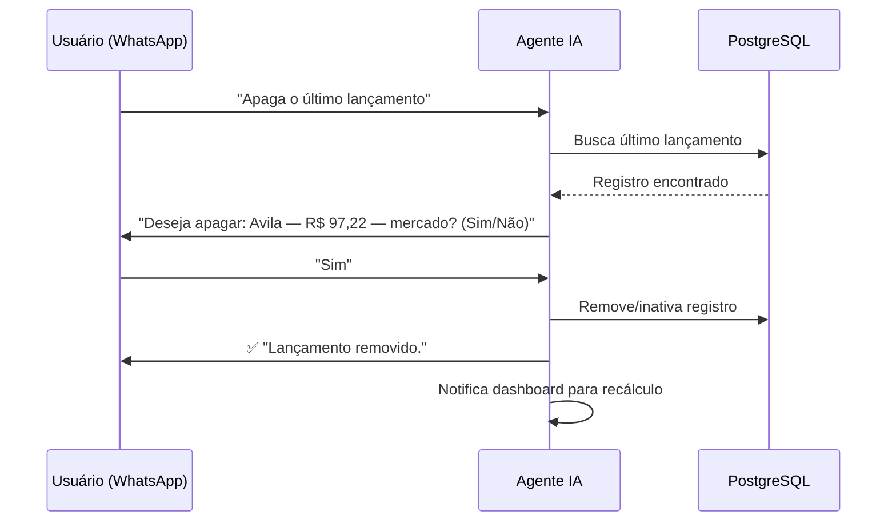
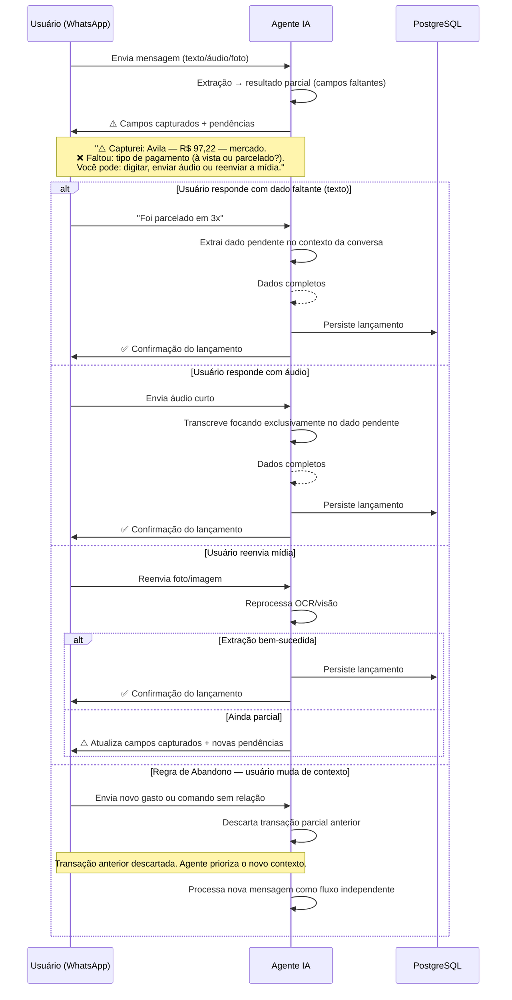
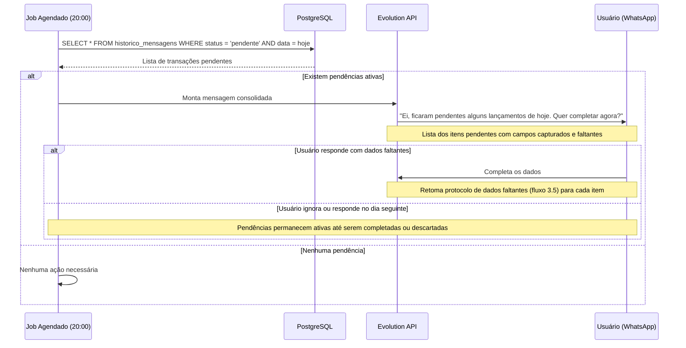
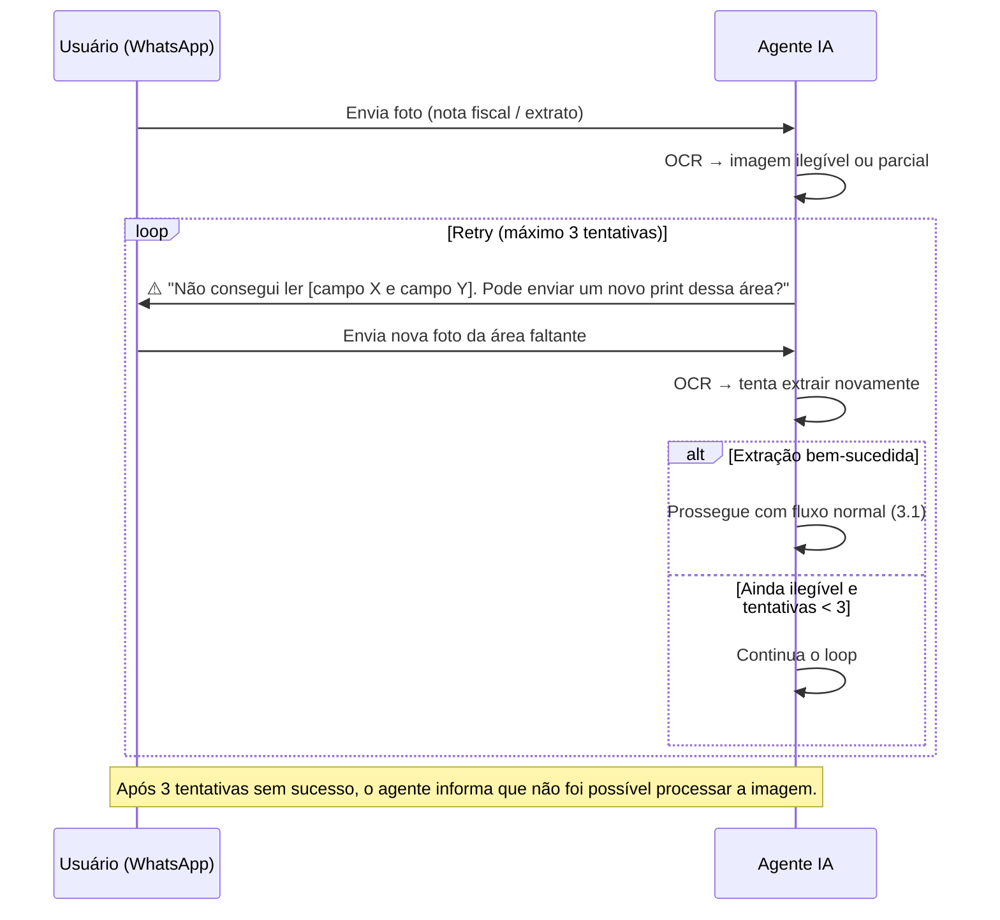

# Especificações Técnicas — Assistente Financeiro via WhatsApp

> Documento gerado a partir da formalização do [Visao_Geral.md](file:///d:/Works/Cyrela_Contrutora/portfolio_repo/whatsapp_repo/admin_files/Visao_Geral.md). Nenhuma regra nova foi adicionada; todas as definições abaixo refletem o que já foi detalhado na Visão Geral.

---

## 1. Requisitos Funcionais

### 1.1 Recebimento de Mensagens (Evolution API → Backend)

| ID    | Requisito                                                                                          |
| ----- | -------------------------------------------------------------------------------------------------- |
| RF-01 | O sistema DEVE receber mensagens do WhatsApp via webhooks da Evolution API (texto, áudio, imagem e documento). |
| RF-02 | O sistema DEVE autenticar a origem da mensagem, processando apenas mensagens de números presentes em uma whitelist de números autorizados. |
| RF-03 | O sistema DEVE proteger os webhooks da Evolution API com token/assinatura.                         |
| RF-04 | Mensagens de áudio e imagem DEVEM ser encaminhadas para uma fila de processamento assíncrono, dado que o processamento pode demorar alguns segundos. |

### 1.2 Agente de IA — Compreensão e Extração

| ID    | Requisito                                                                                          |
| ----- | -------------------------------------------------------------------------------------------------- |
| RF-05 | O agente DEVE identificar a **intenção** da mensagem: novo gasto, correção de lançamento, consulta ao banco ou resumo do mês. |
| RF-06 | Para mensagens de **texto**, o agente DEVE extrair os campos estruturados: `estabelecimento`, `setor`, `tipo`, `valor`, `parcelas`, `data_hora`. |
| RF-07 | Para mensagens de **áudio**, o agente DEVE transcrever o conteúdo via speech-to-text (ex.: Whisper) e, em seguida, aplicar a mesma extração estruturada do RF-06. |
| RF-08 | Para mensagens de **imagem** (foto de nota fiscal ou extrato), o agente DEVE extrair o texto via OCR/visão (ex.: GPT-4o Vision) e aplicar a extração estruturada do RF-06. |
| RF-09 | O agente DEVE registrar o campo `origem` de cada lançamento, indicando o tipo de entrada: `whatsapp-texto`, `whatsapp-audio` ou `whatsapp-foto`. |
| RF-10 | O agente DEVE registrar os identificadores da mensagem original (`messageId` e/ou `key.id`), mantendo os campos separados em colunas — não em JSON. |
| RF-11 | O agente DEVE manter **memória de conversa** (contexto da thread no WhatsApp) para permitir desambiguação em interações multi-turno. |

### 1.3 Agente de IA — Cadastro de Cartão

| ID    | Requisito                                                                                          |
| ----- | -------------------------------------------------------------------------------------------------- |
| RF-12 | Ao receber o **primeiro lançamento** sem cartão cadastrado, o agente DEVE solicitar ao usuário os dados do cartão, enviando o formato esperado com base na estrutura da tabela de cartões. |
| RF-13 | Após o cadastro do cartão, o agente DEVE perguntar se este será o **cartão padrão** ou se o sistema deve confirmar/enviar uma lista de cartões para o usuário escolher a cada novo lançamento. |

### 1.4 Agente de IA — Confirmação e Persistência

| ID    | Requisito                                                                                          |
| ----- | -------------------------------------------------------------------------------------------------- |
| RF-14 | Para valores altos ou dados incompletos, o agente DEVE solicitar confirmação do usuário antes de salvar no banco. |
| RF-15 | Nos primeiros meses de operação, o sistema DEVE operar em modo **"sempre confirmar antes de salvar"**. |
| RF-16 | Quando a confiança na extração for alta e os dados estiverem completos, o agente PODE salvar diretamente sem confirmação (fora do modo de confirmação obrigatória). |
| RF-17 | Após a persistência do lançamento no banco, o agente DEVE enviar uma resposta de confirmação no WhatsApp, no formato: *"Cadastrei: [Estabelecimento] — R$ [Valor] — [Setor] — [Tipo]"*. |

### 1.5 Protocolo de Tratamento de Dados Faltantes

| ID    | Requisito                                                                                          |
| ----- | -------------------------------------------------------------------------------------------------- |
| RF-36 | Sempre que a extração de uma transação for **parcial** (qualquer campo essencial ausente), o agente **NÃO DEVE** persistir o lançamento no banco. O registro só será gravado após a obtenção de todos os campos obrigatórios. |
| RF-37 | Ao identificar extração parcial, o agente DEVE iniciar a resposta com o emoji **⚠️**, exibir os campos já capturados com sucesso (para validação visual do usuário) e apontar claramente quais informações essenciais ficaram pendentes. |
| RF-38 | O agente DEVE instruir o usuário de que ele pode completar os dados faltantes de **três formas**: reenviando a mídia, digitando a informação ou enviando um **áudio curto** explicando o dado que faltou. |
| RF-39 | Se o usuário responder com um **áudio** no contexto de dados faltantes, o sistema DEVE processar a transcrição focando **exclusivamente** em extrair a informação pendente do contexto anterior. |
| RF-40 | A transação parcial DEVE aguardar a resposta do usuário **indefinidamente** (sem timeout automático). |
| RF-41 | **Regra de Abandono (Mudança de Contexto):** Se a próxima mensagem do usuário for um comando ou gasto completamente novo e sem relação com o dado pendente, a transação parcial anterior DEVE ser **descartada** e o agente DEVE priorizar o novo contexto. |
| RF-43 | **Alerta de Fechamento Diário:** O sistema DEVE manter um log de operações incompletas (status `pendente`). Ao final do dia (ex.: 20:00), caso existam pendências ativas que não foram abandonadas, o sistema DEVE disparar um **alerta único** no WhatsApp consolidando todos os itens pendentes e lembrando o usuário de completar os dados faltantes para fechar os lançamentos do dia. O alerta DEVE incluir a lista dos itens pendentes para facilitar o preenchimento. |

### 1.6 Feedback Visual no WhatsApp

| ID    | Requisito                                                                                          |
| ----- | -------------------------------------------------------------------------------------------------- |
| RF-18 | Ao receber a mensagem e iniciar o processamento, o sistema DEVE enviar um emoji de **ampulheta** (⏳) indicando que está processando. |
| RF-19 | Após a persistência com sucesso, o sistema DEVE enviar um emoji de **check** (✅) indicando que o lançamento foi processado. |
| RF-42 | Ao identificar extração parcial, o sistema DEVE enviar o emoji **⚠️** seguido dos campos capturados e das pendências (conforme RF-37). |

### 1.7 Consultas e Operações

| ID    | Requisito                                                                                          |
| ----- | -------------------------------------------------------------------------------------------------- |
| RF-20 | O agente DEVE responder consultas do tipo *"Quanto gastei em [setor] esse mês?"*, consultando o banco e retornando a resposta no WhatsApp. |
| RF-21 | O agente DEVE processar comandos de **remoção/correção** de lançamentos (ex.: *"Apaga o último lançamento"*), buscando o registro, solicitando confirmação e atualizando banco e dashboard. |

### 1.8 Normalização de Estabelecimentos

| ID    | Requisito                                                                                          |
| ----- | -------------------------------------------------------------------------------------------------- |
| RF-22 | O sistema DEVE normalizar nomes de estabelecimentos, vinculando nomes informais do WhatsApp aos nomes oficiais da fatura (ex.: "Avila" = "LUIS CLAUDIOMIR DE AVIL"). |
| RF-23 | Para estabelecimentos novos classificados como posto de gasolina, restaurante ou mercado, o agente DEVE perguntar ao usuário se deseja guardar um nome personalizado (ex.: "Posto Shell", "Mercado Guanabara") para buscas posteriores. |

### 1.9 Regras de Negócio — Tipos de Gasto e Projeção

| ID    | Requisito                                                                                          |
| ----- | -------------------------------------------------------------------------------------------------- |
| RF-24 | O sistema DEVE classificar cada lançamento em um dos tipos: **à vista**, **assinatura**, **fixo** ou **parcelado Nx**. |
| RF-25 | O sistema DEVE categorizar lançamentos em setores: mercado, ferramenta, lanche, cursos, viagem, entre outros. |
| RF-26 | Para **projeções financeiras**, o sistema DEVE considerar: assinaturas, fixos e parcelas em andamento **continuam**; gastos à vista pontuais **não voltam no próximo mês**; gastos recorrentes por natureza (mercado, gasolina, lanche) **entram na estimativa**. |

### 1.10 Dashboard Web

| ID    | Requisito                                                                                          |
| ----- | -------------------------------------------------------------------------------------------------- |
| RF-27 | O dashboard DEVE exibir KPIs, gráficos, projeções, ofensores e cortes analíticos.                 |
| RF-28 | O dashboard DEVE atualizar em **tempo real** (via WebSocket, SSE ou polling) ao receber novos lançamentos. |
| RF-29 | O dashboard DEVE suportar importação de PDF/CSV de faturas e cruzamento com lançamentos do WhatsApp (fase futura). |

### 1.11 Alertas e Cartões

| ID    | Requisito                                                                                          |
| ----- | -------------------------------------------------------------------------------------------------- |
| RF-30 | O sistema DEVE emitir alerta quando um cartão estiver a **3 meses do vencimento**.                |
| RF-31 | O sistema DEVE suportar **alertas configuráveis** pelo usuário (ex.: semanal ou a cada 3 dias), com mensagens como *"Você passou de R$ X em lanche este mês"* ou *"Você já gastou R$ Y — seu limite atual é R$ Z"* (fase futura). |

### 1.12 Segurança e Operação

| ID    | Requisito                                                                                          |
| ----- | -------------------------------------------------------------------------------------------------- |
| RF-32 | Toda comunicação DEVE ocorrer via HTTPS.                                                           |
| RF-33 | O banco de dados DEVE possuir rotina de **backup**.                                                |
| RF-34 | A API NÃO DEVE ser exposta publicamente sem autenticação.                                          |
| RF-35 | O sistema DEVE manter **logs de mensagens processadas** para revisão de erros da IA e auditoria.   |
| RF-44 | O ambiente de execução do sistema DEVE ser orquestrado via **Easypanel**, isolando o banco de dados (PostgreSQL) e o backend em containers independentes que se comunicam por rede interna. |
| RF-45 | O backend do sistema DEVE ser containerizado utilizando um arquivo **Dockerfile**, expondo a porta necessária para o recebimento dos webhooks da Evolution API. |
| RF-46 | Todas as chaves secretas, strings de conexão e tokens DEVEM ser injetados estritamente via variáveis de ambiente configuradas na aba "Environment Variables" do Easypanel, proibindo credenciais hardcoded. |

---

## 2. Arquitetura de Dados

### 2.1 Diagrama Relacional

### 2.2 Detalhamento das Tabelas

#### Tabela `lancamentos` (Tabela Principal)

Espelho da planilha/fatura. Armazena cada despesa registrada.

| Campo               | Tipo         | Descrição                                                                 |
| ------------------- | ------------ | ------------------------------------------------------------------------- |
| `id`                | `SERIAL PK`  | Identificador único do lançamento                                        |
| `estabelecimento_id`| `INT FK`      | Referência à tabela `estabelecimentos`                                   |
| `setor_id`          | `INT FK`      | Referência à tabela `setores`                                            |
| `cartao_id`         | `INT FK`      | Referência à tabela `cartoes`                                            |
| `fatura_id`         | `INT FK NULL` | Referência à tabela `faturas_importadas` (quando houver vínculo)         |
| `tipo`              | `VARCHAR`     | Classificação: `a_vista`, `assinatura`, `fixo`, `parcelado`              |
| `valor`             | `DECIMAL`     | Valor monetário do gasto (ex.: 97.22)                                    |
| `parcelas`          | `VARCHAR`     | Indicador de parcelamento (ex.: "1 de 12"). `NULL` se à vista            |
| `data_hora`         | `TIMESTAMP`   | Data e hora do gasto                                                     |
| `origem`            | `VARCHAR`     | Tipo de entrada: `whatsapp-texto`, `whatsapp-audio`, `whatsapp-foto`     |
| `message_id`        | `VARCHAR`     | Identificador da mensagem original na Evolution API (coluna separada)    |
| `key_id`            | `VARCHAR`     | Identificador `key.id` da mensagem (coluna separada)                     |
| `created_at`        | `TIMESTAMP`   | Data de criação do registro                                              |
| `updated_at`        | `TIMESTAMP`   | Data da última atualização                                               |

---

#### Tabela `setores`

Tabela auxiliar de categorias de gasto.

| Campo  | Tipo        | Descrição                                                        |
| ------ | ----------- | ---------------------------------------------------------------- |
| `id`   | `SERIAL PK` | Identificador único do setor                                    |
| `nome` | `VARCHAR`    | Nome do setor (ex.: mercado, ferramenta, lanche, cursos, viagem) |

---

#### Tabela `estabelecimentos`

Tabela auxiliar para normalização de nomes de estabelecimentos.

| Campo            | Tipo        | Descrição                                                                                     |
| ---------------- | ----------- | --------------------------------------------------------------------------------------------- |
| `id`             | `SERIAL PK` | Identificador único do estabelecimento                                                       |
| `nome_exibicao`  | `VARCHAR`    | Nome informal/curto usado pelo usuário (ex.: "Avila")                                        |
| `nome_fatura`    | `VARCHAR`    | Nome como aparece na fatura do cartão (ex.: "LUIS CLAUDIOMIR DE AVIL")                       |
| `setor_id`       | `INT FK`     | Referência à tabela `setores`                                                                |
| `obs`            | `VARCHAR`    | Observação personalizada guardada pelo usuário (ex.: "Posto Shell", "Mercado Guanabara")     |

---

#### Tabela `cartoes`

Armazena os cartões de crédito cadastrados pelo usuário.

| Campo               | Tipo         | Descrição                                                                                                              |
| -------------------- | ------------ | ---------------------------------------------------------------------------------------------------------------------- |
| `id`                 | `SERIAL PK`  | Identificador único do cartão                                                                                         |
| `banco_origem`       | `VARCHAR`     | Nome do banco emissor                                                                                                 |
| `ultimos_4_digitos`  | `VARCHAR(4)`  | Últimos 4 dígitos do número do cartão                                                                                 |
| `vencimento`         | `DATE`        | Data de vencimento do cartão (usado para alerta quando faltar 3 meses)                                                |
| `bandeira`           | `VARCHAR`     | Bandeira do cartão (Visa, Mastercard, etc.)                                                                           |
| `limite_total`       | `DECIMAL`     | Limite total do cartão                                                                                                |
| `limite_em_uso`      | `DECIMAL`     | Valor do limite atualmente em uso                                                                                     |
| `limite_restante`    | `DECIMAL`     | Valor do limite disponível                                                                                            |
| `qt_assinaturas`     | `INT`         | Quantidade de assinaturas recorrentes vinculadas ao cartão                                                            |
| `valores_futuros`    | `JSONB`       | Lista ordenada com até 3 posições de valores projetados. Ex.: `{"2026-08": 500.00, "2026-09": 300.00, "2026-10": 300.00}` |
| `cartao_padrao`      | `VARCHAR`     | Indica se é o cartão padrão do usuário: `sim` ou `nao`                                                               |
| `obs`                | `TEXT`        | Observações gerais sobre o cartão                                                                                     |

---

#### Tabela `faturas_importadas`

Armazena referências a faturas importadas (PDF/CSV) com vínculo a cartões e lançamentos.

| Campo                | Tipo         | Descrição                                             |
| -------------------- | ------------ | ----------------------------------------------------- |
| `id`                 | `SERIAL PK`  | Identificador único da fatura importada              |
| `cartao_id`          | `INT FK`      | Referência à tabela `cartoes`                        |
| `arquivo_referencia` | `VARCHAR`     | Caminho ou identificador do arquivo importado        |
| `periodo_referencia` | `VARCHAR`     | Mês/ano de referência da fatura                      |
| `created_at`         | `TIMESTAMP`   | Data de importação                                   |

---

#### Tabela `historico_mensagens`

Registro de auditoria e debug de todas as mensagens processadas.

| Campo                 | Tipo         | Descrição                                                    |
| --------------------- | ------------ | ------------------------------------------------------------ |
| `id`                  | `SERIAL PK`  | Identificador único do registro                             |
| `message_id`          | `VARCHAR`     | Identificador da mensagem na Evolution API                  |
| `key_id`              | `VARCHAR`     | Identificador `key.id` da mensagem                          |
| `tipo_mensagem`       | `VARCHAR`     | Tipo recebido: `texto`, `audio`, `imagem`, `documento`      |
| `conteudo_original`   | `TEXT`        | Conteúdo original da mensagem (texto, transcrição ou OCR)   |
| `conteudo_processado` | `TEXT`        | Resultado da extração estruturada pela IA                   |
| `status`              | `VARCHAR`     | Status do processamento (ex.: `recebido`, `processado`, `erro`) |
| `created_at`          | `TIMESTAMP`   | Data de recebimento da mensagem                             |

---

## 3. Fluxos de Conversa e Tratamento de Erros

### 3.1 Fluxo Principal — Lançamento de Gasto (Sucesso)

### 3.2 Fluxo de Cadastro de Cartão (Primeiro Lançamento)

### 3.3 Fluxo de Consulta

### 3.4 Fluxo de Remoção / Correção

### 3.5 Protocolo de Tratamento de Dados Faltantes (Texto/Imagem/Áudio)

Aplica-se sempre que a extração de uma transação for parcial, independentemente do tipo de entrada (texto, áudio ou imagem). O lançamento **NÃO** é persistido até que todos os campos essenciais estejam completos.

> **Regra de Abandono:** A transação parcial aguarda resposta indefinidamente (sem timeout). Porém, se a próxima mensagem for um comando ou gasto completamente novo e sem relação com o dado pendente, a transação anterior é descartada e o agente prioriza o novo contexto.

### 3.6 Alerta de Fechamento Diário

Job agendado que roda ao final do dia (ex.: 20:00). Consolida todas as transações com status `pendente` que não foram abandonadas e dispara um lembrete único no WhatsApp.

### 3.7 Tratamento de Erros — Imagem Ilegível (Política de Retry)

Especialização do protocolo de dados faltantes (3.5) para o caso específico de imagens ilegíveis. Aplica-se quando o OCR falha em extrair **qualquer** dado legível.

### 3.8 Fluxo de Dados Incompletos — Perguntas de Desambiguação

O agente utiliza a **memória de conversa** (contexto da thread) para resolver dados faltantes:

| Cenário                           | Pergunta do Agente                                           |
| --------------------------------- | ------------------------------------------------------------ |
| Setor não identificado            | *"Foi gasto de qual setor? (mercado, lanche, ferramenta…)"* |
| Tipo de pagamento ambíguo         | *"Foi parcelado? Quantas vezes?"*                            |
| Valor alto sem confirmação        | *"Confirma o lançamento de R$ X,XX em [estabelecimento]?"*  |
| Estabelecimento novo (posto/mercado/restaurante) | *"Quer guardar como 'Posto Shell' para buscas futuras?"*    |

### 3.9 Resumo dos Status de Processamento

| Status        | Descrição                                                        |
| ------------- | ---------------------------------------------------------------- |
| `recebido`    | Mensagem recebida pelo webhook, aguardando processamento         |
| `processando` | Mensagem na fila de processamento (áudio/imagem)                 |
| `pendente`    | Extração parcial — aguardando dado faltante do usuário (protocolo 3.5) |
| `aguardando`  | Aguardando confirmação explícita do usuário (modo confirmação)   |
| `processado`  | Lançamento persistido com sucesso                                |
| `descartado`  | Transação parcial abandonada por mudança de contexto (regra de abandono) |
| `erro`        | Falha no processamento (ilegível após 3 tentativas, erro de IA)  |

---

## Referências

- Documento fonte: [Visao_Geral.md](file:///d:/Works/Cyrela_Contrutora/portfolio_repo/whatsapp_repo/admin_files/Visao_Geral.md)
- Roadmap de fases (MVP): definido na seção "MVP (primeira versão enxuta)" da Visão Geral
