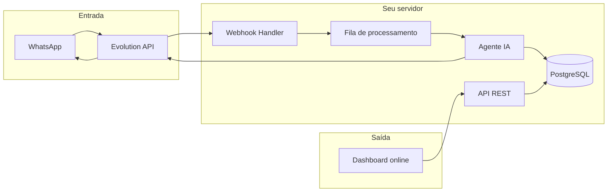

## Visão geral

Uma aplicação pessoal de controle de gastos em que você **lança despesas pelo WhatsApp** (texto, áudio ou foto) e um **agente de IA** interpreta, confirma quando necessário e **salva no banco de dados**. Um **dashboard web** mostra os mesmos dados em tempo real: ofensores, gráficos, projeções e cortes — como os painéis que já montamos, só que alimentados automaticamente.

O WhatsApp vira a interface de entrada; o servidor (Evolution API + backend + IA) é o cérebro; o dashboard é a visualização.

---

## Fluxo do usuário

1. Você manda no WhatsApp algo como:
   - *"Gastei 97 reais no Avila, mercado"*
   - Um áudio: *"Paguei 300 no Cursor, assinatura de ferramenta"*
   - Uma foto da nota fiscal ou do extrato do cartão

2. O sistema recebe a mensagem via **Evolution API** (webhook no seu número).

3. O **agente de IA**:
   - Transcreve áudio (speech-to-text)
   - Extrai texto de imagem (OCR), se for foto
   - Entende estabelecimento, valor, setor, tipo (à vista, parcelado, assinatura etc.)
   - Pergunta de volta se faltar algo: *"Foi parcelado? Quantas vezes?"*

1. Após confirmação (ou confiança alta), **grava no banco**.

2. O **dashboard online** atualiza sozinho com o novo lançamento e recalcula totais, gráficos e projeções.

---

## Componentes do sistema

### 1. WhatsApp + Evolution API
- Instância Evolution API conectada a um dos seus números
- Webhooks para mensagens recebidas (texto, áudio, imagem, documento)
- Envio de respostas: confirmações, perguntas, resumos (*"Cadastrei: Avila — R$ 97,22 — mercado — à vista"*) 
  - Enviar uma Ampuleta informando que está Processando
  - Após persitido enviar um Emoji de Check ✅informando que já foi processado

### 2. Backend (API própria)
- Recebe eventos da Evolution API
- Orquestra IA, persistência e notificações ao dashboard
- Autenticação: só processa mensagens do seu número (ou lista permitida)
- Fila para áudio/imagem (processamento pode demorar alguns segundos)

### 3. Agente de IA
- **NLU:** entender intenção (novo gasto, correção, consulta, resumo do mês)
- Cadastro de Cartão: Ao lançar a primeira compra o modelo deve perguntar os dados do cartão pra ele cadastrar (envia formato com base na tabela de cartão) e perguntando se esse vai ser o padrão ou se confirmar antes enviando uma lista pro usuario clicar e escolher onde deve registrar o gasto após receber a mensagem.
- **Extração estruturada:** campos alinhados ao que você já usa:
  - `estabelecimento`, `setor`, `tipo`, `valor`, `parcelas` (ex.: 1 de 12), `data_hora`, `origem` (whatsapp-texto/áudio/foto), `messageId` ou `key.id` (se possivel e mantendo os campos separados em colunas não em json)
- **Multimodal:** Whisper ou similar para áudio; visão/OCR para fotos de notas e faturas
- **Memória de conversa:** contexto da thread no WhatsApp para desambiguação
- **Confirmação:** em valores altos ou dados incompletos, pede OK antes de salvar
	-  "retry" (max 3), caso a imagem tenha ficado ilegivel ou apenas parcial responder mandando um exclamação do que não conseguiu extrair e pedir um novo print da área faltante.

### 4. Banco de dados
- Tabela principal de **lançamentos** (espelho da planilha/fatura)
- Tabelas auxiliares: **setores**, **estabelecimentos** (normalização: "Avila" = "LUIS CLAUDIOMIR DE AVIL"), Cartoes (banco de origem, 4 ultimos digitos, vencimento (para alerta caso falte 3 meses para vencer), bandeira, limite total, limite em uso, limite restante, qt_assinaturas, `valores_futuros` (Uma lista ordenada com as 3 posições de valores, ex: {"2026-08": 500.00, "2026-09": 300.00, "2026-10": 300.00}), cartao_padrao(sim,nao), obs (exemplo se foi posto de gasolina ou restaurante ou mercado, perguntar se o usuario quer guardar o nome, tipo Posto Shell, Mercado Guanabara, etc, para busca posterior)
- **Faturas importadas** (PDF/CSV futuro) e vínculo com lançamentos do cartão
- Histórico de mensagens processadas (auditoria e debug)

### 5. Dashboard web (online)
- Evolução dos HTMLs locais para app hospedado (React/Next ou similar)
- KPIs, gráficos, projeção, “não volta no próximo mês”, cortes
- Atualização em tempo real (WebSocket ou polling)
- Opcional: importar PDF/CSV de fatura e cruzar com lançamentos do WhatsApp

---

## Arquitetura (alto nível)

---

## Exemplos de interação

| Você manda                             | Agente faz                                           |
| -------------------------------------- | ---------------------------------------------------- |
| *"150 no posto"*                       | Pergunta setor se não inferir → gasolina → cadastra  |
| Áudio de 10s descrevendo compra        | Transcreve → extrai → confirma → cadastra            |
| Foto da nota do mercado                | OCR → valor + loja → sugere setor mercado → cadastra |
| *"Quanto gastei em mercado esse mês?"* | Consulta DB → responde no WhatsApp                   |
| *"Apaga o último lançamento"*          | Busca último → confirma → remove/atualiza dashboard  |

---

## Regras de negócio

- **Tipo de gasto:** à vista, assinatura, fixo, parcelado Nx
- **Setores:** mercado, ferramenta, lanche, cursos, viagem, etc.
- **Projeção:** assinaturas/fixos/parcelas em andamento continuam; à vista pontual “não volta”; mercado/gasolina/lanche entram na estimativa
- **Normalização:** mesmo estabelecimento com nomes diferentes na fatura vs WhatsApp

---

## Stack sugerida (referência)

| Camada     | Opções                                                            |
| ---------- | ----------------------------------------------------------------- |
| WhatsApp   | Evolution API                                                     |
| Backend    | Node.js ou Python (FastAPI)                                       |
| IA         | OpenAI (tool calling para `criar_lancamento`)                     |
| Áudio      | Whisper API                                                       |
| Imagem     | GPT-4o vision ou OCR dedicado                                     |
| Banco      | PostgreSQL + Prisma/Drizzle                                       |
| Dashboard  | Next.js + Chart.js (como os painéis atuais)                       |
| Deploy     | VPS (Evolution + API) + Vercel/Railway (dashboard) ou tudo na VPS |
| Tempo real | Supabase Realtime, Socket.io ou SSE                               |

---

## Segurança e operação

- Whitelist de números autorizados
- Evolution API e webhooks com token/assinatura
- Dados financeiros: HTTPS, backup do banco, sem expor API publicamente sem auth
- Logs de mensagens para revisar erros da IA
- Modo “sempre confirmar antes de salvar” nos primeiros meses

### Diretrizes de Infraestrutura e Deploy (Easypanel)
O ambiente do sistema deve ser provisionado utilizando o **Easypanel** como orquestrador, dividindo-se em duas camadas integradas que se comunicam por rede interna:

1. **Serviço de Banco de Dados:** Instância do PostgreSQL criada de forma nativa e isolada dentro do painel do Easypanel.
2. **Serviço de Backend:** Aplicação containerizada (Docker) que rodará o código do agente, conectando-se ao banco via string de conexão interna e expondo a porta do webhook para comunicação com a Evolution API.
3. **Variáveis de Ambiente:** Todas as credenciais de APIs (OpenAI, Evolution), tokens de segurança e chaves de banco devem ser gerenciadas centralizadamente na aba "Environment Variables" do Easypanel, alimentando o arquivo `.env` da aplicação.

### Protocolo de Tratamento de Dados Faltantes (Texto/Imagem/Áudio)
Sempre que a extração de uma transação for parcial, o agente não deve salvar no Postgres ainda. Ele deve disparar o seguinte fluxo:

1. Iniciar a resposta com o emoji ⚠️.
2. Exibir os campos capturados com sucesso para validação visual do usuário.
3. Apontar claramente qual informação essencial ficou pendente.
4. Instruir o usuário de que ele pode corrigir o problema de três formas: reenviando a mídia, digitando a informação ou enviando um ÁUDIO curto explicando o dado que faltou.
5. Se o usuário responder com um áudio, o sistema irá processar a transcrição focando exclusivamente em extrair a informação que estava faltando no contexto anterior.

* **Regra de Abandono (Mudança de Contexto):** A transação parcial aguará a resposta do usuário indefinidamente. No entanto, se a próxima mensagem do usuário for um comando ou gasto completamente novo e sem relação com o dado pendente, a transação anterior é descartada e o agente prioriza o novo contexto.

* **Alerta de Fechamento Diário:** O sistema deve manter um log dessas operações incompletas (status pendente). Ao final do dia (ex: 20:00), caso existam pendências ativas que não foram abandonadas, o sistema deve disparar um alerta único no WhatsApp consolidando e lembrando o usuário de informar o que ficou faltando para fechar os lançamentos do dia. Exemplo de alerta: *"Ei, ficaram pendentes alguns lançamentos de hoje. Quer completar agora?"* seguido da lista dos itens pendentes para facilitar o preenchimento.

---

## MVP (primeira versão enxuta)

1. Evolution API recebendo **só texto**
2. IA extrai gasto → salva no PostgreSQL
3. Dashboard simples listando lançamentos + total do mês
4. Resposta automática no WhatsApp confirmando o cadastro

**Fase 2:** áudio e foto  
**Fase 3:** projeções, ofensores e importação de PDF/CSV de fatura  
**Fase 4:** alertas definidos pelo usuario, por exemplo semanal ou a cada 3 dias (*"você passou de R$ X em lanche este mês"*) ou/e você já gastou um total de R$ e Seu limite atual é R$
Fase 5: Importar arquivos do Google Drive (pois o usuario pode baixar do celular direto pra ele)

---

## Nome / identidade (sugestões)

- **GastoZap**
- **FinBot Whats**
- **Conta no Zap**

---

Em uma frase: **um assistente financeiro no WhatsApp que transforma mensagens, áudios e fotos em lançamentos estruturados, com dashboard online sempre atualizado — usando Evolution API no seu número e um agente de IA no meio.**